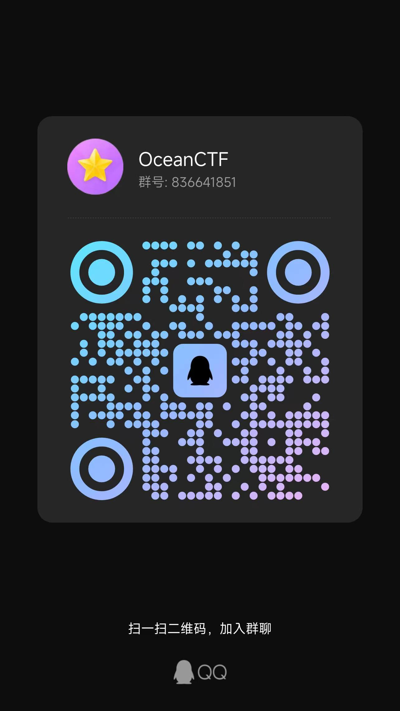
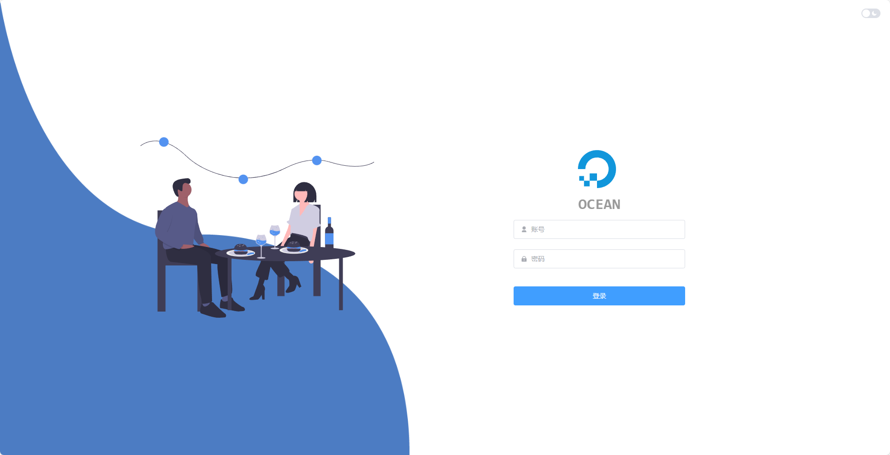
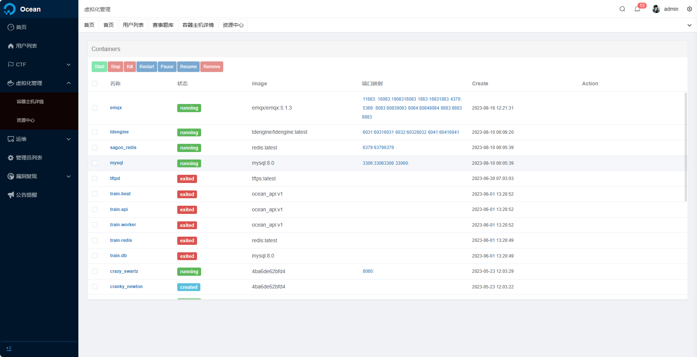
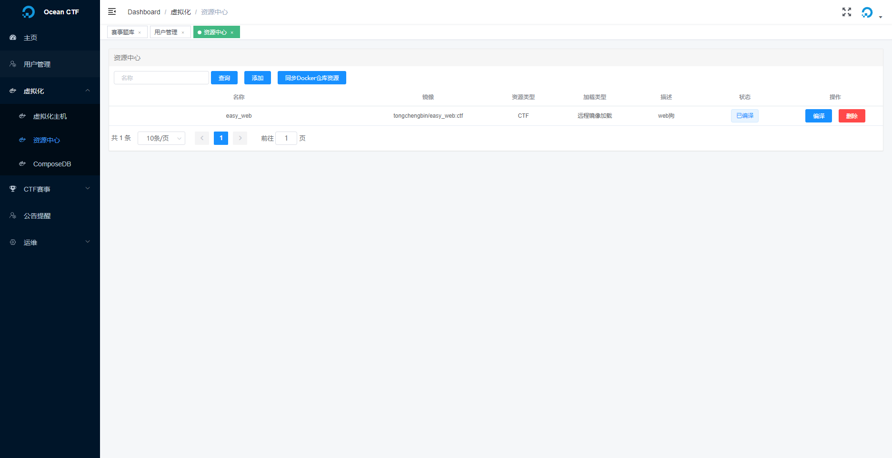
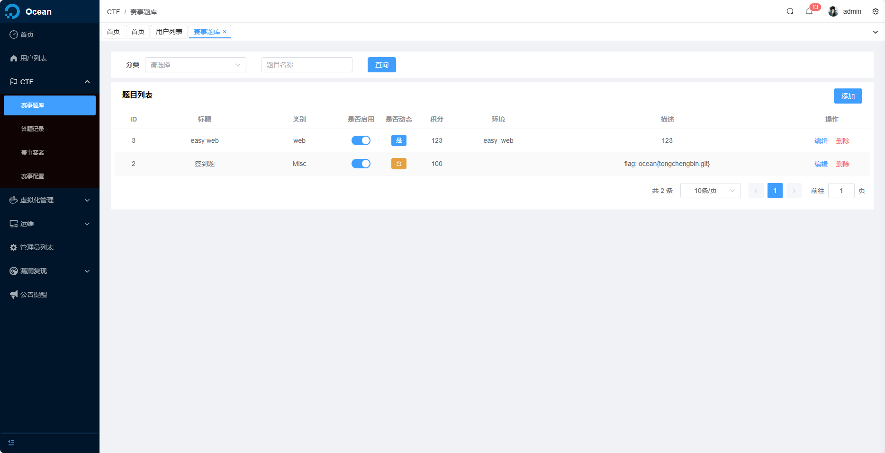
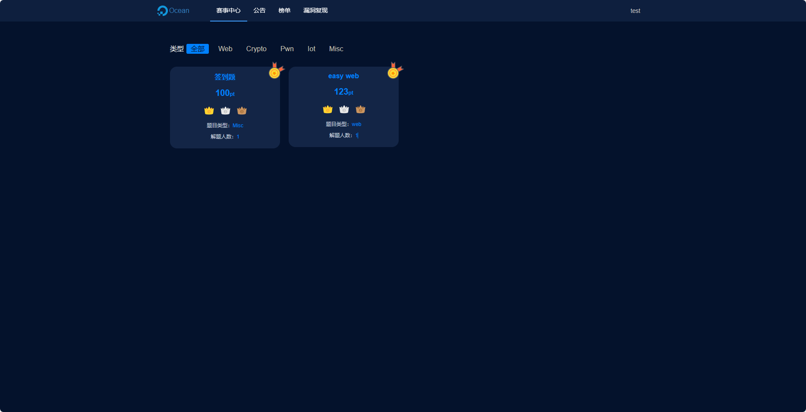
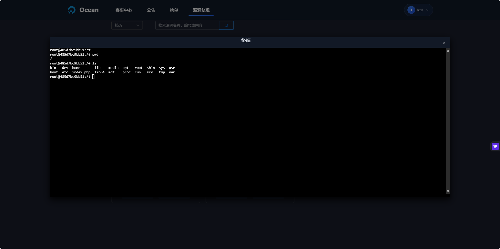
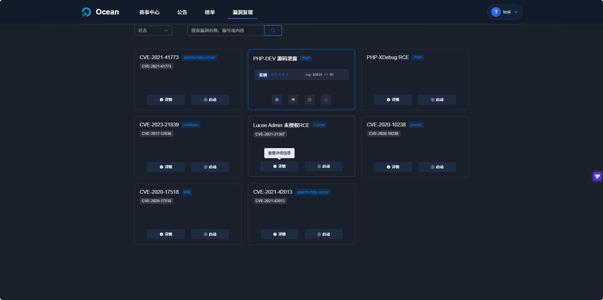

# 🌊 Ocean CTF

一个动态 flag 练习靶场平台

## ✅ TODO

- [x] 容器管理
- [x] 题库管理
- [x] 动态 flag
- [x] 作弊检测
- [x] 公告通知
- [x] 动态启动题库
- [x] 题库隔离
- [x] 公告通知
- [x] 排行榜
- [x] 快速部署
- [ ] 大屏展示
- [x] 权限分离
- [x] 一键部署
- [x] 多端口开放
- [ ] compose 容器支持
- [ ] fix bug
- [ ] 添加镜像功能页面重构
- [x] 漏洞复现

## 🚀 预览

线上地址 http://ctf.lostpeach.cn/

`测试用户: test/test`

管理后台 http://ctf.lostpeach.cn/manager

`访客管理账号 guest/guest`

## SASS

赛事版 http://ocean.lostpeach.cn/

## 📖 安装

##### clone

- 克隆代码

```
git clone https://github.com/tongchengbin/ocean_ctf.git /opt/ocean_ctf
```

- docker-compose 编排镜像

```
cd /opt/ocean_ctf
cp .env_example .env
docker-compose up -d
```

- 初始化系统
  访问 /manager

`默认账号
admin/admin`

## 使用

#### 小记

经过几次的改版还是觉得单纯的 docker 方式比 docker-compose 更加方便;启动和关闭的速度更快、
题目共享、磁盘释放更方便等，
同时对于 ctf 比赛 docker-compose 的场景比较小，因此 CTF 动态仅支持 docker 启动。后续会有靶场相关会支持 docker-compose 以及 docker 启动，
关于为何移除 docker 远程调用目前是觉得增加了初级用户的使用难度所以暂时移除。

### 动态题目

通过虚拟化-资源中心添加题目资源，题目资源可以使用本地镜像、远程镜像、如 CTFDB 项目中提供了默认题目可以通过同步功能拉取题库或在[dockerhub](https://hub.docker.com/r/tongchengbin/easy_web)中查看题目

添加资源后需要进行编译（PULL）、因为编译是个比较耗时的操作(和网络环境有关)、所以建议先本地拉取 image 后点击编译按钮。
后续的操作与之前的版本一样、添加赛事题库选择动态题目和对应的资源环境即可。

## 📃 题库

> 题库仓库：[GitHub - tongchengbin/ctfdb: ctf 题库](https://github.com/tongchengbin/ctfdb)

## 💻 题库格式说明

> TODO

### 漏洞复现

漏洞复现支持 vulhub 部分镜像可以直接导入，但是推荐使用[CTFDB Vulnerability](https://github.com/tongchengbin/ctfdb) 仓库进行维护,内置 export 脚本支持自动扫描导出漏洞文件，该文件可以在平台 漏洞复现-漏洞资源中导入

## 开发

后台管理源码：https://github.com/tongchengbin/ocean_manager

### 依赖管理与代码质量

项目使用 `pyproject.toml` 来管理依赖和配置代码质量工具，并使用 Makefile 来简化常用命令。

#### 安装依赖

```bash
# 安装基本依赖
pip install -e .

# 安装开发依赖（包括代码质量工具和测试工具）
pip install -e ".[dev,test]"
# 或者使用 Makefile
make install-dev
```

#### 代码质量工具

```bash
# 运行所有代码检查工具
make lint

# 只运行 flake8
make lint-flake8

# 只运行 pylint
make lint-pylint

# 格式化代码（使用 black 和 isort）
make format

# 清理 Python 缓存文件
make clean

# 运行测试
make test
```

要查看所有可用命令，请运行：

```bash
make help
```

## 社群

QQ 群: 836641851

  

## License

[MIT](https://github.com/tongchengbin/ocean_ctf/blob/master/LICENSE)

Copyright (c) 2022-present tongcb

## 截图

- 管理员登录
  

- Home
  

- Docker
  

- 资源中心
  
- 编译镜像

  

- 编译进度

  

- 镜像列表
  

- 题目列表
  
- 赛事环境
  
- 答题记录
  

- 用户首页
  

- 启动容器
  

- 漏洞复现 Shell
  
- 靶场
  

- 漏洞复现
  
