# 🌊 Ocean CTF
一个动态flag练习靶场平台

## ✅ TODO

- [x] 容器管理 
- [x] 题库管理
- [x] 动态flag
- [x] 作弊检测
- [x] 公告通知
- [x] 动态启动题库
- [x] 题库隔离
- [x] 公告通知
- [x] 排行榜
- [x] 快速部署
- [ ] 大屏展示
- [x] 权限分离
- [ ] 一键部署
- [ ] fix bug
- [ ] fix bug


## 🚀 预览

线上地址 http://159.75.92.142:8080
管理后台 http://159.75.92.142:8080/manager  访客账号  test/test  
默认超级管理员账号 superuser/admin

## 🌍 使用

如何添加容器主机？

1. 启用docker api   —H tcp://0.0.0.0:2375 （一定要添加防火墙规则仅允许指定ip访问）

2. curl 127.0.0.1:2375/_ping    输出OK 说明启用成功

3. 添加主机ip 一栏是web 应用的入口如果是公网云请填写公网地址、如果是虚拟机请填写与物理机同一网段地址，docker API 一栏可以填写127.0.0.1:2375 这是由于部分服务器仅仅只对本地地址开放了2375端口，而如果是docker-compose 部署则无法使用127.0.0.1 可以使用docker的172网段代替。

   


## 📖 安装步骤

##### clone

```
git clone https://github.com/tongchengbin/ocean_ctf.git /opt/ocean_ctf
```


### docker方式

> docker 编排会引用.env文件中的环境变量

##### 前置环境

```
docker、docker-compose
```

##### compose编排
```
cd /opt/ocean_ctf
docker-compose up -d
```
##### 访问测试
```
curl 127.0.0.1:8080
```
### 手动安装

##### 前置环境

```
Python 3.6+
mysql 5.6+
redis
nginx(可选)
docker(可选)
supervisord(可选)

```

##### 安装Python依赖

```
cd /opt/ocean_ctf
pip3 install -r requirements.txt
```


##### 快速运行

```shell
chmod +x ./run.sh
./run.sh
```

## 📗 进阶文档

##### 通过nginx代理
> 默认情况下项目已经给管理后台的页面做了静态处理 但是建议使用nginx处理静态文件

```
# vim /etc/nginx/conf.d/ctf.conf
server {
        listen       8080 default_server;
        server_name  _;
        location / {
        proxy_pass http://127.0.0.1:5000;
        }
    location /manager {
        alias /opt/ocean_ctf/install/manager/dist;
    }
    }
```
##### 使用supervisord托管程序
因为celery可能会因为程序异常而退出 所以使用supervisord托管celery 同时也可方便管理，如果使用supervisord托管进程，不要使用run.sh 启动避端口冲突

1. 安装supervisord

   ```shell
   yum install -y supervisord
   ```
3. 配置托管程序

   ```shell
   cp ./install/config/supervisord/ocean.ini /etc/supervisord.d/
   ```
   
2. 设置开机启动

   ```shell
   systemctl enable supervisord.service
   systemctl start supervisord.service
   ```

##### 开启 Docker API 2375 端口
```
开启API
vim /usr/lib/systemd/system/docker.service
ExecStart=/usr/bin/dockerd -H fd:// --containerd=/run/containerd/containerd.sock -H tcp://0.0.0.0:2375
systemctl daemon-reload
systemctl restart docker

检查API
curl 127.0.0.1:2375/info
```


## ️️❗ 常见问题&注意事项

#### 安装常用环境依赖
```
yum -y install python36-devel
```

#### pip 报错mysqlclinet
```
centos: sudo yum install mysql-devel
ubuntu: sudo apt-get install libmysqlclient-dev

```


## 📃 题库

>  题库仓库：[GitHub - tongchengbin/ctfdb: ctf 题库](https://github.com/tongchengbin/ctfdb)

## 💻 题库格式说明
> TODO


## 开发

  后台管理源码：https://github.com/tongchengbin/ocean_manager
## 其他截图

- 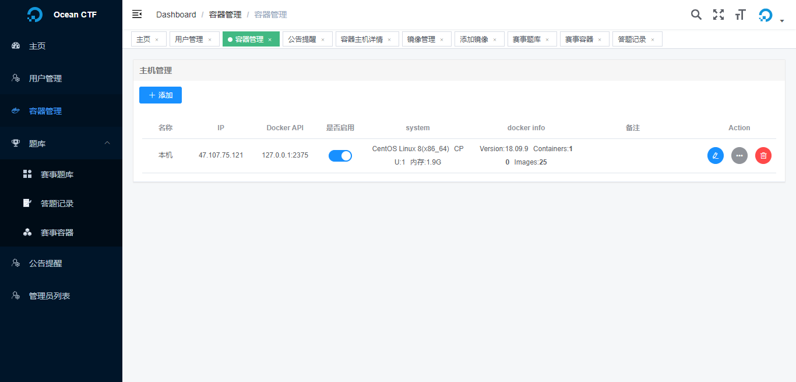

- 容器主机详情

  ​	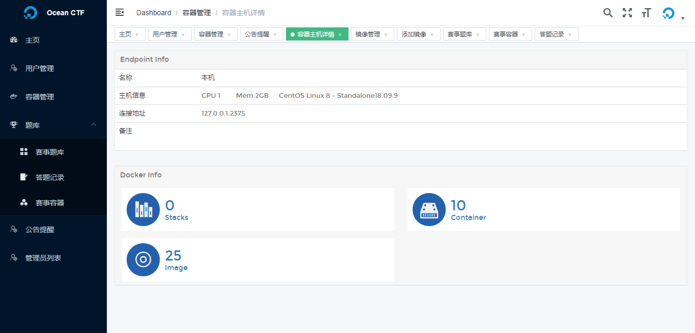

- 编译镜像

  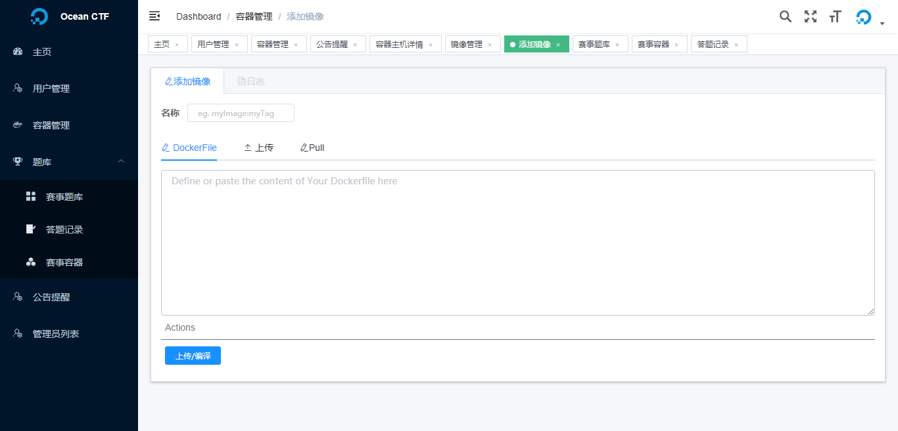

- 编译进度

  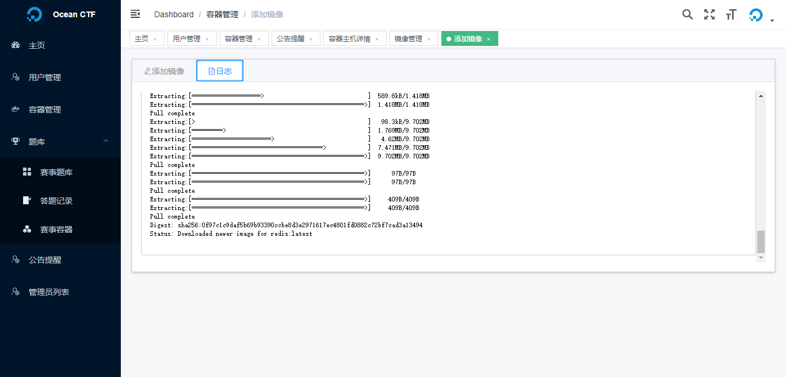

- 镜像列表

  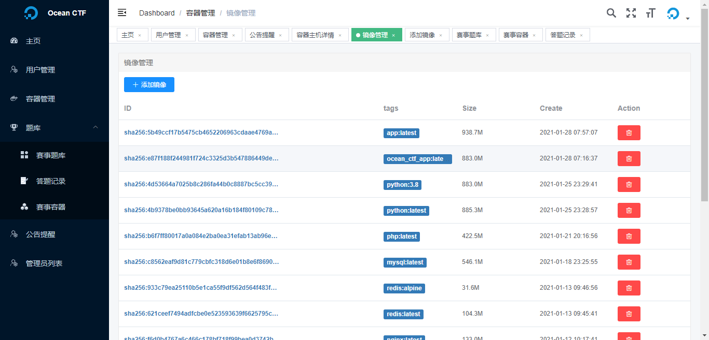

- 添加动态题库

  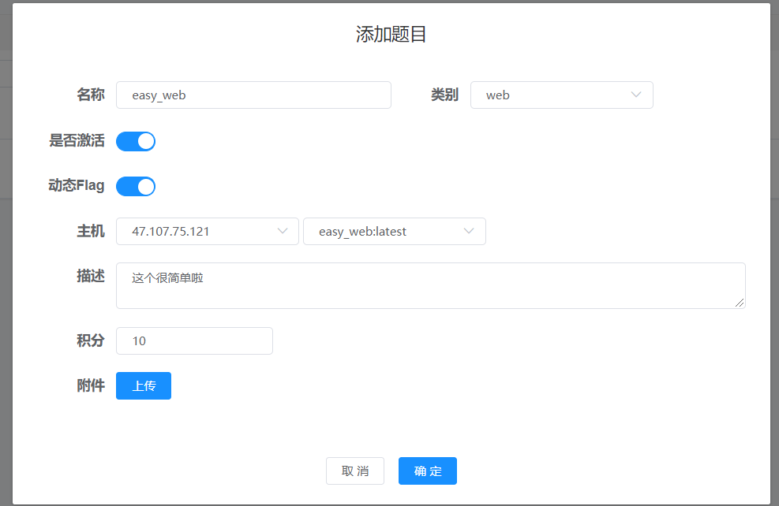

- 首页

  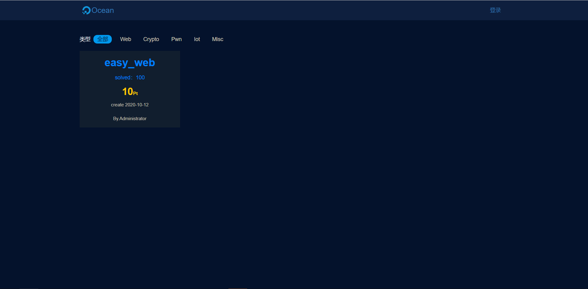

* 启动容器

  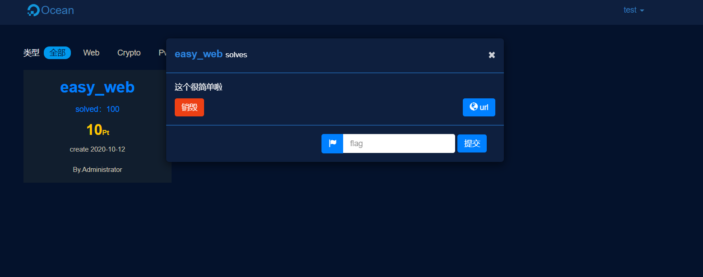

- 靶场

  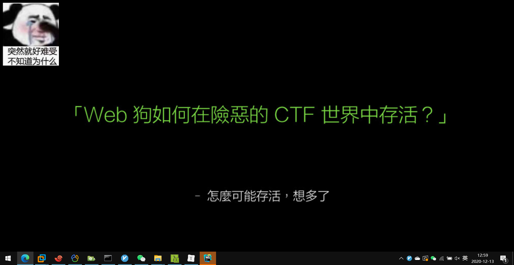 
  
- 管理后台

  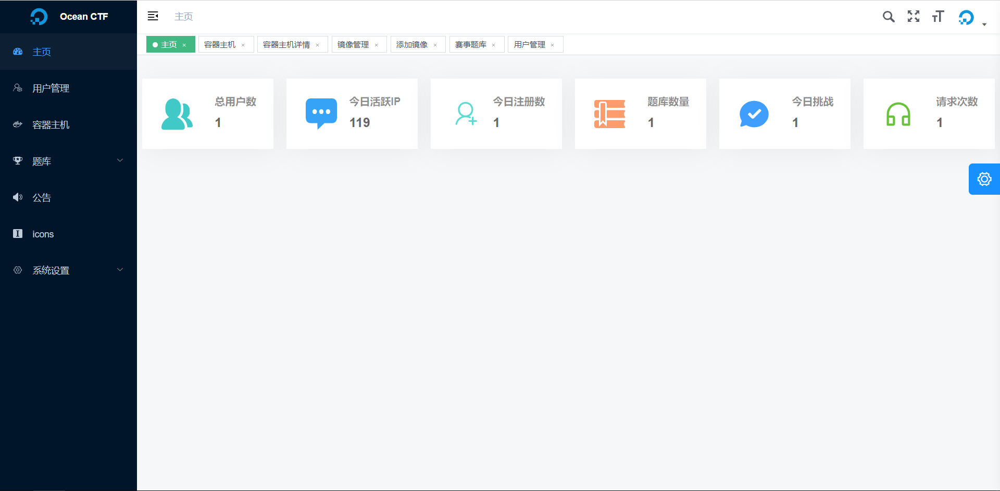

  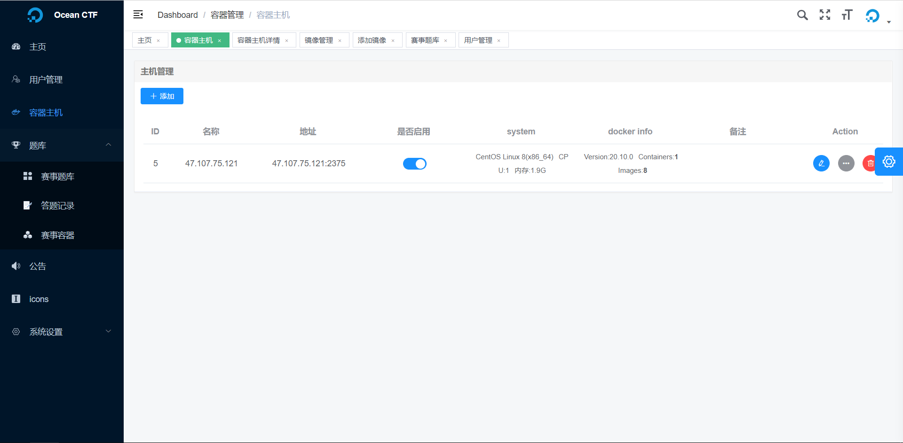

  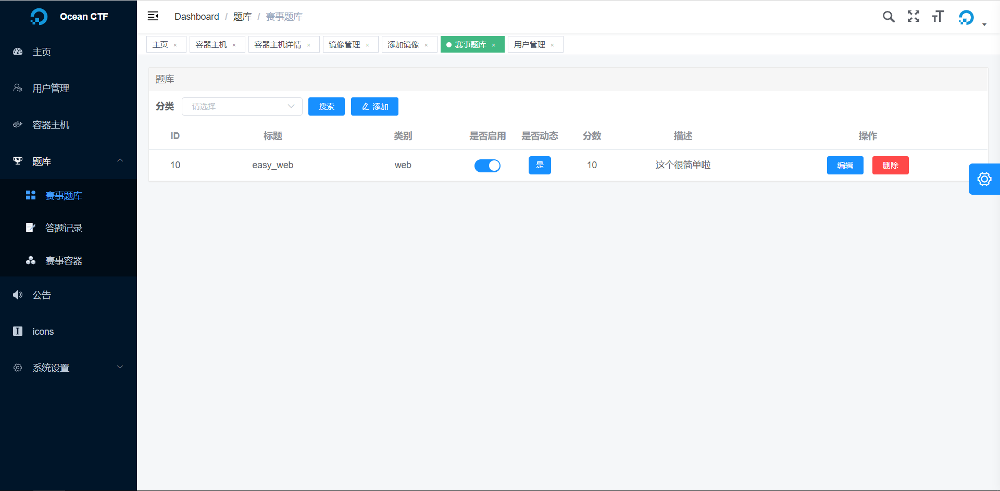

  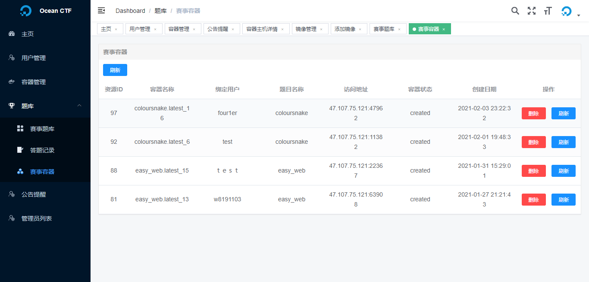

  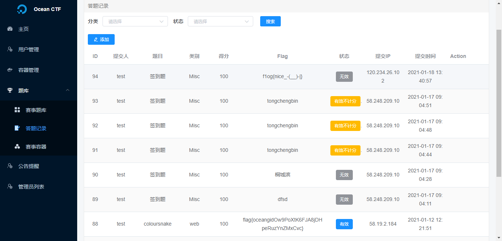
