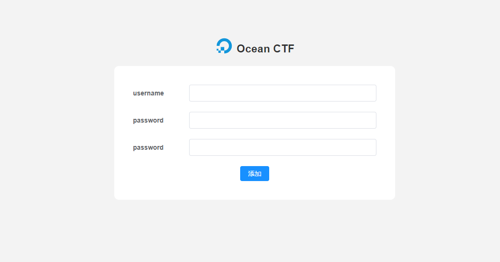

# 🌊 Ocean CTF
一个动态flag练习靶场平台

## ✅ TODO

- [x] 容器管理 
- [x] 题库管理
- [x] 动态flag
- [x] 作弊检测
- [x] 公告通知
- [x] 动态启动题库
- [x] 题库隔离
- [x] 公告通知
- [x] 排行榜
- [x] 快速部署
- [ ] 大屏展示
- [x] 权限分离
- [x] 一键部署
- [x] 多端口开放
- [ ] compose容器支持
- [ ] fix bug
- [ ] 添加镜像功能页面重构


## 🚀 预览

线上地址 http://101.43.27.219/

管理后台 http://101.43.27.219/manager

测试账号 test/test


## 📖 安装

##### clone
* 克隆代码
```
git clone https://github.com/tongchengbin/ocean_ctf.git /opt/ocean_ctf
```

* docker-compose 编排镜像
```
cd /opt/ocean_ctf
docker-compose up -d
```
* 初始化系统

访问 /manager 设置管理员账号和初始化


## 使用

#### 小记
经过几次的改版还是觉得单纯的docker方式比docker-compose更加方便;启动和关闭的速度更快、
题目共享、磁盘释放更方便等，
同时对于ctf比赛docker-compose的场景比较小，因此CTF动态仅支持docker启动。后续会有靶场相关会支持docker-compose以及docker启动，
关于为何移除docker 远程调用目前是觉得增加了初级用户的使用难度所以暂时移除。

### 动态题目
通过虚拟化-资源中心添加题目资源，题目资源可以使用本地镜像、远程镜像、如CTFDB项目中提供了默认题目可以通过同步功能拉取题库或在[dockerhub](https://hub.docker.com/r/tongchengbin/easy_web)中查看题目

添加资源后需要进行编译（PULL）、因为编译是个比较耗时的操作(和网络环境有关)、所以建议先本地拉取image后点击编译按钮。
后续的操作与之前的版本一样、添加赛事题库选择动态题目和对应的资源环境即可。

## 📃 题库

>  题库仓库：[GitHub - tongchengbin/ctfdb: ctf 题库](https://github.com/tongchengbin/ctfdb)

## 💻 题库格式说明
> TODO


### 开发

  后台管理源码：https://github.com/tongchengbin/ocean_manager
  
### License

[MIT](https://github.com/tongchengbin/ocean_ctf/blob/master/LICENSE)

Copyright (c) 2022-present tongcb


### 截图

- 初始化界面
  


- 资源中心
  
  
- 编译镜像

  

- 编译进度

  

- 镜像列表

  

- 添加动态题库

  

- 首页

  

- 启动容器

  

- 靶场

   
  
- 管理后台

  

  

  

  

  
